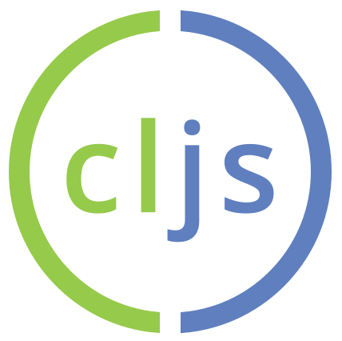

# Intro to ClojureScript

@maria__geller

%

* Personal background
* ClojureScript Syntax
* Demos
* Outro

%


<!-- Clojure/ClojureScript developer at LiveOps -->

%


<!-- Online MSc student at Georgia Tech -->

%


<!-- GSoC student working on the ClojureScript compiler -->
<!-- GSoC: program to introduce students to open source orgainzations -->

%



%

> Clojure rocks and JavaScript reaches.

*Rich Hickey, NYC Clojure meet up 20 July 2011*

<!-- ClojureScript was introduced in 2011 -->
<!-- compiles Clojure to JavaScript -->

%

### Clojure

* Lisp dialect
* runs on the JVM
* immutable data structures
* macros

<!-- Clojure: introduced in 2007, Lisp dialect, runs on the JVM -->
<!-- immutable data structures, macros,  -->

%

### Symbols

<textarea class="cljs-code">
(= (symbol "foo") 'foo)
</textarea>
<div class="cljs-run"></div>
<textarea class="cljs-result"></textarea>

<!-- symbols are bare words, evaluate to other values, such as functions  -->
<!-- symbols are bare words, evaluate to other values, such as function  -->

%

### Keywords

<textarea class="cljs-code">
(= (keyword "foo") :foo)
</textarea>
<div class="cljs-run"></div>
<textarea class="cljs-result"></textarea>

<!-- keywords evaluate to themself  -->

%

### Data Structures - List

<textarea class="cljs-code">
(def my-list '(1 2 3))
</textarea>
<div class="cljs-run"></div>
<textarea class="cljs-result"></textarea>

%

### Data Structures - Vector

<textarea class="cljs-code">
(def my-vector ["foo" "bar"])
</textarea>
<div class="cljs-run"></div>
<textarea class="cljs-result"></textarea>

%

### Data Structures - Map

<textarea class="cljs-code">
(def my-map {:firstname "Maria" :lastname "Geller"})
</textarea>
<div class="cljs-run"></div>
<textarea class="cljs-result"></textarea>

%

### Data Structures - Set

<textarea class="cljs-code">
(def my-set #{1 2 2 3})
</textarea>
<div class="cljs-run"></div>
<textarea class="cljs-result"></textarea>

%

### Equality

<textarea class="cljs-code">
(= "2" 2)
</textarea>
<div class="cljs-run"></div>
<textarea class="cljs-result"></textarea>

%

### Equality

<textarea class="cljs-code">
(= 0 0.0)
</textarea>
<div class="cljs-run"></div>
<textarea class="cljs-result"></textarea>

<!-- equality on numbers has javascript (not clojure's) semantic -->


%

### Functions

<textarea class="cljs-code">
(defn my-add [x y] (+ x y))
(my-add 3 4)
</textarea>
<div class="cljs-run"></div>
<textarea class="cljs-result"></textarea>

<!-- equality on numbers has javascript (not clojure's) semantic -->

%

### JS interop

<textarea class="cljs-code">
(set! (.. js/document -body -style -backgroundColor) "lightgray")
</textarea>
<div class="cljs-run"></div>
<textarea class="cljs-result"></textarea>

%

### JS interop

<textarea class="cljs-code">
(.alter js/window "Hello, AkJS")
</textarea>
<div class="cljs-run"></div>
<textarea class="cljs-result"></textarea>

%

### Google Closure Tools

* Google Closure compiler
* Google Closure library

%

### Google Closure library

* used for Search, Gmail, Maps etc.
* dependency management

%

### Google Closure compiler

* compiles JavaScript to better JavaScript
* dead code elimination
* 3 optimization levels

%

Before optimization:
```javascript
function hello (name) {
    return "Hello, " + name;
}

console.log(hello("World"));
```

After optimization:
```javascript
console.log("Hello, World")
```

%

### Demos

%

* Source Maps
* REPLs
* Frameworks

%

# More info

* [ClojureScript GitHub Wiki](https://github.com/clojure/clojurescript/wiki)
* [ClojureScript Koans](http://clojurescriptkoans.com/)
* [ClojureScript Unraveled](https://funcool.github.io/clojurescript-unraveled/)
* [clojurians Slack](http://clojurians.net/)
* [LispCast Video Tutorials](http://www.purelyfunctional.tv/single-page-applications)
